# Inundaciones-GEE


<h1>Introducción al uso de imágenes de Radar de Apertura Sintética en Google Earth Engine aplicado a la agricultura</h1> 
<h2>Manual de detección de inundaciones con Google Earth Engine</h2> 

<p>Este manual fue elaborado por la Escuela de Geografía de la Universidad de Costa Rica, para el cual colaboraron Emmanuel Jesús Céspedes-Rivera y Cristian Aguilar-Barboza en calidad de asistentes avanzados del proyecto "Transformación digital: Incorporación de tecnología SAR en la gestión de riesgos, agricultura y recursos naturales para Centroamérica", en el marco del proyecto UCREA-IICA.</p>
<p>Este proyecto está coordinado por el Dr Edgar Espinoza Cisneros y co-cordinado por MSc María José Molina Montero. Para mayor información contactar a maria.molinamontero@ucr.ac.cr .</p>

<p>Índice</p> 

<p><li><a href="#Sección1">1. Prerrequisitos</a></li>
<li><a href="#Sección2">2. Introducción</a></li>
<li><a href="#Sección3">3. Interfaz de Google Earth Engine</a></li>
<li><a href="#Sección4">4. Procesamiento y análisis</a></li>
<li><a href="#Sección5">5. Conclusiones y recomendaciones</a></li>
<li><a href="#Sección6">6. Bibliografía</a></li></p> 

<p><h2 id="Sección1">1. Prerrequisitos</h2></p>

<p>Para ejecutar esta rutina el usuario previamente debe crear una cuenta en la plataforma Google Earth Engine (GEE), ingresando en <p><a href="https://earthengine.google.com/" target="_blank">https://earthengine.google.com/</a></p> GEE, es una plataforma para la visualización y análisis de datos geoespaciales en la nube, por lo tanto, no existe la necesidad de invertir equipos y programas especializados (Google Earth Engine, 2019). GEE tiene disponible repositorios de información entre los cuales se encuentran: series temporales de Landsat, Sentinel, MODIS, SRTM, entre otros.</p> 

<p>Esta plataforma utiliza en su editor de código el lenguaje de programación JAVA, aunque también posee una API Python vinculada al Google Drive.</p> 

<p>Como guía para crear una cuenta en GEE ingrese a:</p> 


<p><a href="https://www.youtube.com/watch?v=E60J32Umqeo" target="_blank">https://www.youtube.com/watch?v=E60J32Umqeo</a></p>

<p><h2 id="Sección2">2. Introducción</h2></p>

<p>La información confiable sobre la distribución espacial de las aguas superficiales es de importancia crítica en varias disciplinas científicas. El Radar de Apertura Sintética (SAR por sus siglas en inglés) es una forma efectiva de detectar inundaciones y monitorear cuerpos de agua en grandes áreas. Sentinel-1 es un SAR en banda-C de libre acceso, que dada su resolución espacial y líneas de base temporal cortas, tienen el potencial de facilitar el monitoreo de los cambios en las aguas superficiales, que son dinámicos en el espacio y el tiempo.</p>

<p>Cabe destacar que la detección remota con sensores ópticos requieren de observaciones con productos de buena calidad, sin nubes o sombras de nubes para minimizar la confusión espectral de los datos (Shen et al., 2019), sin embargo, en zonas tropicales como el caso del área de estudio seleccionada, donde las coberturas nubosas son constantes y abundantes, su aplicación resulta limitada (Flores et al., 2019). Debido a este aspecto, se ha implementado el uso de la imágenes SAR, la cual despeja la limitante de la nubosidad y permite la obtención continua de información (Flores et al., 2019).</p>

<p>Se aplicó una metodología de detección de cambio y umbral para determinar inundaciones de un conjunto de imágenes SAR Sentinel-1, cuyo procesamiento se realizó en Google Earth Engine (GEE). Se utilizó la polarización VV, ya que esta presenta resultados de inundación más plausibles en este sensor (Clement. et al,. 2017). Se consideró como área de estudio la zona cercana a la llanura de inundación del río Zapote en Upala, durante el paso del huracán Otto, sucedido en noviembre 2016.</p>

<p>GEE es una plataforma en la nube que posee acceso de diferentes repositorios de información, caso de Landsat, MODIS, Sentinel, SoilGrids, SRTM, ALOS-Palsar, HydroSheds entre muchos otros que favorecen el monitoreo agrícola de forma gratuita y sin cargas computacionales elevadas.</p> 
<p><h3>
  
<p><h3>2.1. Objetivos de aprendizaje:</h3></p>

<p><li>Introducir al manejo de la interfaz de editor de código de GEE.</li>
<li>Analizar los procesos de interacción de la señal SAR con la superficie terrestre.</li>
<li>Detectar cambios asociados áreas inundadas.</li>
<li>Identificar ventajas y desventajas del uso de imágenes SAR en la detección de inundaciones con GEE.</li></p>


<p><h2 id="Sección3">3. Interfaz de Google Earth Engine</h2></p>
 

<p>Para abrir el editor de código ingrese en: <a href="https://earthengine.google.com/" target="_blank">https://earthengine.google.com/</a>, y ubiquese en la opción 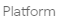  (Fig 1), luego seleccione Code Editor.</p> 
  
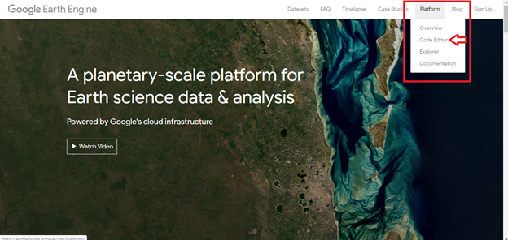
<h4 id="Sección3">Fig 1. Acceso al code editor desde la página web de Google Earth Engine.</h4>

<p>Una vez hecho esto se le desplegará el editor de código de GEE, el cual se detalla en la Fig 2.</p> 
  
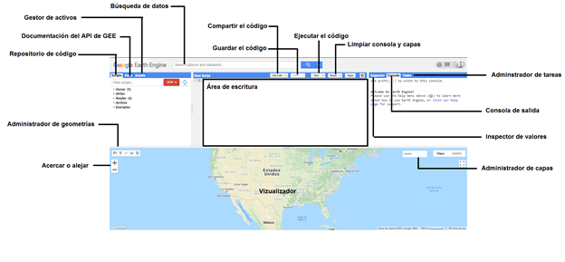
<h4 id="Sección3">Fig 2. Interfaz de editor de código GEE.</h4>

<p>Es importante señalar que en la plataforma en “repositorio de código” en la sección de <strong>“Examples”</strong> puede encontrar una serie de códigos de ejemplo con diferentes tipos de datos de origen con los cuales puede experimentar y editar a conveniencia para diferentes aplicaciones.<p>

<p><h2 id="Sección4">4. Procesamiento y análisis</h2></p>

<p> <Strong><h3>Nota:</h3></Strong> El código ejecutado en el presente manual se puede acceder por medio del siguiente link: <a href="https://code.earthengine.google.com/cd531d9996d94b2f396ea58733b2617b" target="_blank">https://code.earthengine.google.com/cd531d9996d94b2f396ea58733b2617b</a><p>

<p>Primero se debe generar un polígono (utilice el administrador de geometrías), a partir del cual se mostrará el nivel de zoom y del centro del despliegue del visualizador, esto se ejecuta a través de la casilla <strong>Geometry imports</strong>, en donde se le asigna el nombre de “roi”.<p> 

<p>Una vez realizado este paso se procede a establecer que la visualización se muestra con base a una imagen RGB satelital y se define el centro de visualización (“roi”) y el nivel de zoom respectivamente.</p>

```javascript
Map.setOptions('satellite');
Map.centerObject(roi, 14);
```

<p>Seguidamente proceda a llamar la colección de imágenes de GRD de Sentinel-1, para la polarizaciones  VV. Además, se recorta en relación con “roi” digitalizado previamente.</p>

<p>Copie lo siguiente y pegue en el editor de código:</p> 

```javascript
// Load Sentinel-1 C-band SAR Ground Range collection (log scale, VV, descending)
var collectionVV = ee.ImageCollection('COPERNICUS/S1_GRD')
.filter(ee.Filter.eq('instrumentMode', 'IW'))
.filter(ee.Filter.listContains('transmitterReceiverPolarisation', 'VV'))
.filter(ee.Filter.eq('orbitProperties_pass', 'DESCENDING'))
.filterMetadata('resolution_meters', 'equals' , 10)
.filterBounds(roi)
.select('VV');
```

<p>Puede notar cómo se filtra la polarización (VV), así como el modo de adquisición y la órbita (Descendente), además, se delimita la zona de interés (roi). Para este caso no es posible utilizar la polarización VH dado que no se encuentra disponible.</p>

<p>Una vez realizados estos filtros de la colección, se delimita temporalmente el conjunto de imágenes. Además, se genera un mosaico a partir de estas.</p>
<p>Copie lo siguiente y pegue en el editor de código:</p> 

```javascript
//Filter by date
var beforeVV = collectionVV.filterDate('2016-10-01', '2016-11-15').mosaic()
var afterVV = collectionVV.filterDate('2016-11-20', '2016-11-30').mosaic()
```
<p>El comando “print” permite reflejar los resultados en la consola de GEE (Fig 3), en este caso la cantidad de imágenes disponibles para el área de interés en el periodo asignado.</p>

```javascript
print(beforeVV, 'Before VV');
print(afterVV, 'After VV');
```
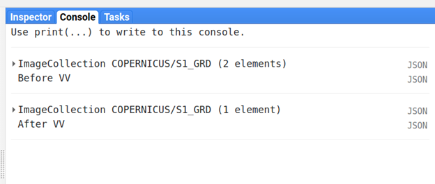
<h4 id="Sección4">Fig 3. Imágenes disponibles en las colecciones VV, en el periodo y área asignada.</h4>

<p>Seguidamente visualice las imágenes de antes y después de las inundaciones, utilizando el comando “Map.addLayer ()”. Para que añada las imágenes al visualizador (Fig 4) pero no las cargue de inmediato, añada un “,0” después del nombre de la banda que se encuentra entre comillas simples y cierre paréntesis.</p>

<p>Copie lo siguiente y pegue en el editor de código:</p> 

```javascript
// Display map
Map.addLayer(beforeVV, {min:-15,max:0}, 'Before flood VV', 0);
Map.addLayer(afterVV, {min:-15,max:0}, 'After flood VV', 0);
```
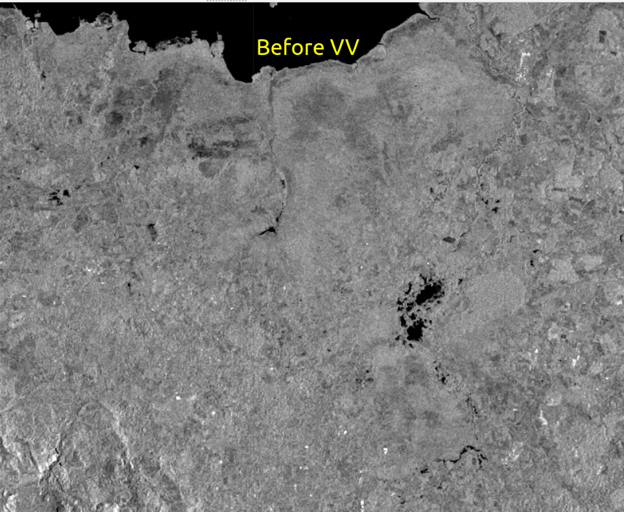
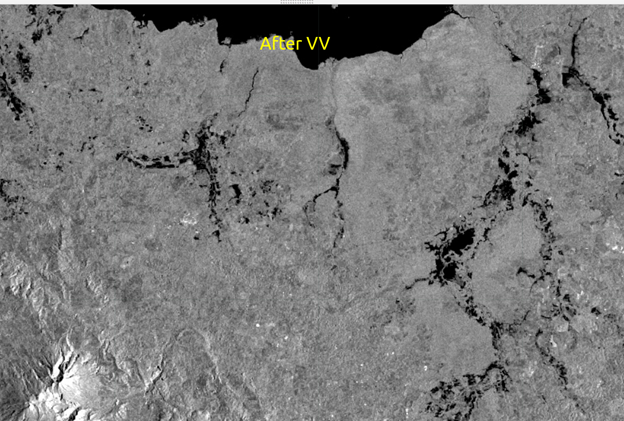
<h4 id="Sección4">Fig 4. Imágenes antes y después de las inundaciones.</h4>

<p>Seguidamente realice una composición con los mosaicos beforeVV y afterVV (Fig 5).</p>

```javascript
//Create image composition
Map.addLayer(beforeVV.addBands(afterVV).addBands(beforeVV), {min: -25, max: -8},
'composite', 0);
```
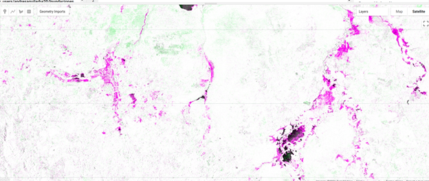
<h4 id="Sección4">Fig 5. Composición de imágenes (beforeVV-afterVV).</h4>

<p>Analice los resultados.</p> 

<p>Para ejecutar la detección de inundaciones se debe corregir el speckle (efecto de sal y pimienta en las imágenes SAR), en este caso se ejecute un “kernel” con la intención de eliminar lo mayor posible el efecto de este ruido. Cabe destacar que la resolución espacial de salida de las imágenes aumenta (ajuste la resolución de salida en la sección de  <Strong>“var SMOOTHING_RADIUS = 50”</Strong> y compare los resultados).</p> 

```javascript
//Apply filter to reduce speckle
var Smooth = 50;
var beforeVV_filtered = beforeVV.focal_mean(Smooth, 'circle', 'meters').clip(roi);
var afterVV_filtered = afterVV.focal_mean(Smooth, 'circle', 'meters').clip(roi);

```

<p>Para observar los resultados de la aplicación del filtro de moteado añada las imágenes al visualizador (Fig 6). Ejecute la siguiente línea de código.</p> 

```javascript
//Display filtered images
Map.addLayer(beforeVV_filtered, {min:-15,max:0}, 'Before Flood VV Filtered',0);
Map.addLayer(afterVV_filtered, {min:-15,max:0}, 'After Flood VV Filtered',0);
```
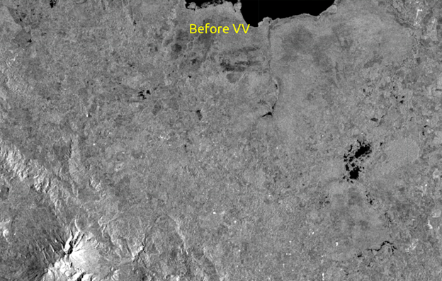
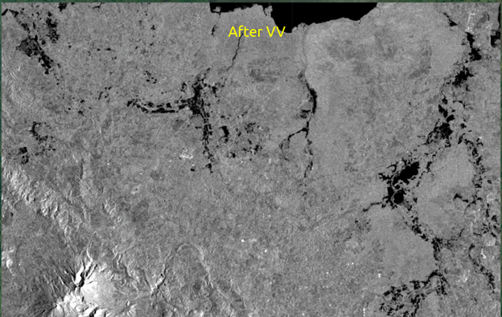
<h4 id="Sección4">Fig 6. Imágenes antes y después de las inundaciones con reducción de moteado (speckle).</h4>

<p>Para detectar los cambios entre las imágenes antes y durante el evento, se procede a ejecutar una diferencia entre las imágenes para así observar las zonas de inundación generadas en el área de interés (Fig 7). Después añada el resultado al visualizador.</p>

```javascript
// Calculate difference between before and after
var differenceVV=
afterVV_filtered.divide(beforeVV_filtered);
Map.addLayer(differenceVV, {min: 0,max:2},
'difference VV filtered', 0);
```
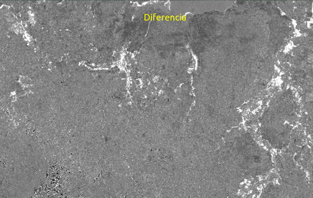
<h4 id="Sección4">Fig 7. Imágen de diferencia (afterVV/beforeVV).</h4>

<p>Para discriminar las zonas de cambio utilice un umbral basado en los resultados (Fig 8) de la diferencia entre la imagen beforeVV y afterVV. Se designó un umbral de 1.80 desviaciones estándar del resultado de la diferencia. Añada el resultado al visualizador. </p>

<Strong><p>Puede cambiar el valor del umbral y comparar resultados.</p></Strong>

```javascript
//Apply Threshold
var Threshold_Up = 1.80;
var differenceVV_thresholded = differenceVV.gt(Threshold_Up);
Map.addLayer(differenceVV_thresholded.updateMask(differenceVV_thresholded),{palette:"#1e1fd6"},'flooded areas');

```

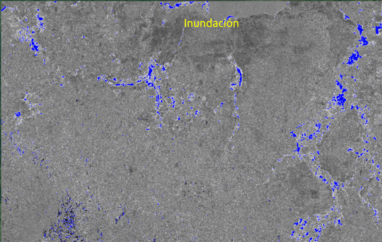
<h4 id="Sección4">Fig 8. Manchas de inundación (azul).</h4>

<p>Una vez que observamos y ajustamos los resultados con base a los valores de umbral procedemos a exportar las áreas inundadas en formato “.tiff” al entorno de Google Drive. Desde donde puede descargar y visualizar este archivo y ejecutar en cualquier software SIG de su  preferencia.</p>

```javascript
// Export the image, specifying scale and region.
Export.image.toDrive({
image: differenceVV_thresholded ,
description: 'Flooding',
scale: 50,
region: roi,
fileFormat: 'GeoTIFF',
});
```

<p><h2 id="Sección5">5. Conclusiones y recomendaciones.</h2></p>

<p>La detección de inundaciones a partir de imágenes SAR presenta una serie de ventajas, como la obtención de información libre de nubosidad y la continuidad en la obtención de datos, aunque, su aplicación se encuentra ligada a los periodos de revisita del sensor y su coincidencia con el evento de inundación.</p>

<p>El método propuesto en este manual es una forma rápida de discriminar inundaciones, utilizando GEE permite procesar este tipo de datos sin la necesidad de equipos sofisticados en software y hardware. No obstante,  si se desea mejorar la precisión es necesario implementar otros procesamientos, Por ejemplo se recomienda la ejecución de un proceso por secciones o lotes, con el fin de establecer umbrales de cambio locales con el fin de abordar las diferencias en retrodispersión generadas por las distintas coberturas y los cambios en la topografía.</p>

<p>De igual forma, existen múltiples algoritmos para la detección de inundaciones con imágenes SAR,  basados en detección de cambio (como en este manual), umbrales de retrodispersión, polarimetría, interferometría, etc. Cada uno con sus ventajas y desventajas.</p> 

<p>Recuerde que dadas las características del sensor Sentinel-1, las zonas inundadas bajo vegetación son difíciles de identificar, para la longitud de onda del Sensor Sentinel-1 (banda C), en muchos casos no logra penetrar las coberturas, detectandose como un área sin cambio.</p>

<p><h2 id="Sección6">6. Bibliografía.</h2></p>

Clement, M. A., Kilsby, C. G., & Moore, P. (2017). Multi-temporal synthetic aperture radar flood mapping using change detection. Journal of Flood Risk Management, 11(2), 152-168. <a href="https://doi.org/10.1111/jfr3.12303" target="_blank">https://doi.org/10.1111/jfr3.12303</a></p>

<p>Flores, A. I., Herndon, K. E., Bahadur Thapa, R., & Cherrington, E. (Eds.). (2019). The Synthetic Aperture Radar (SAR) Handbook: Comprehensive Methodologies for Forest Monitoring and Biomass Estimation. <a href="https://doi.org/10.25966/nr2c-s697" target="_blank">https://doi.org/10.25966/nr2c-s697</a></p>

<p>Shen, W., Li, M., Huang, C., Tao, X., Li, S., & Wei, A. (2019). Mapping annual forest change due to afforestation in Guangdong Province of China using active and passive remote sensing data. Remote Sensing, 11(5), 1-21. <a href="https://doi.org/10.3390/rs11050490" target="_blank">https://doi.org/10.3390/rs11050490</a></p>
